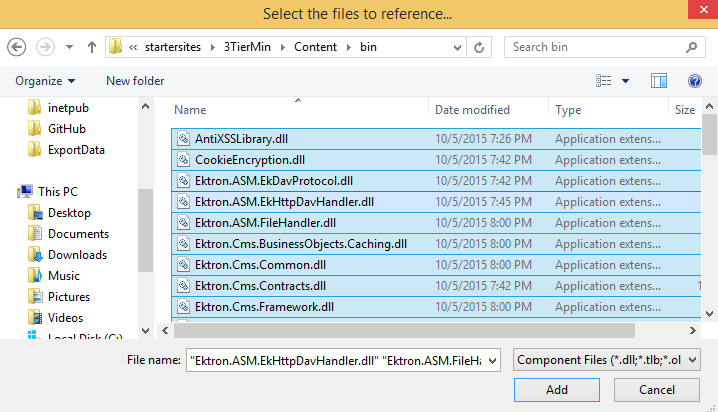
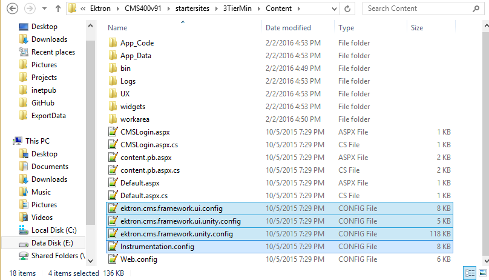
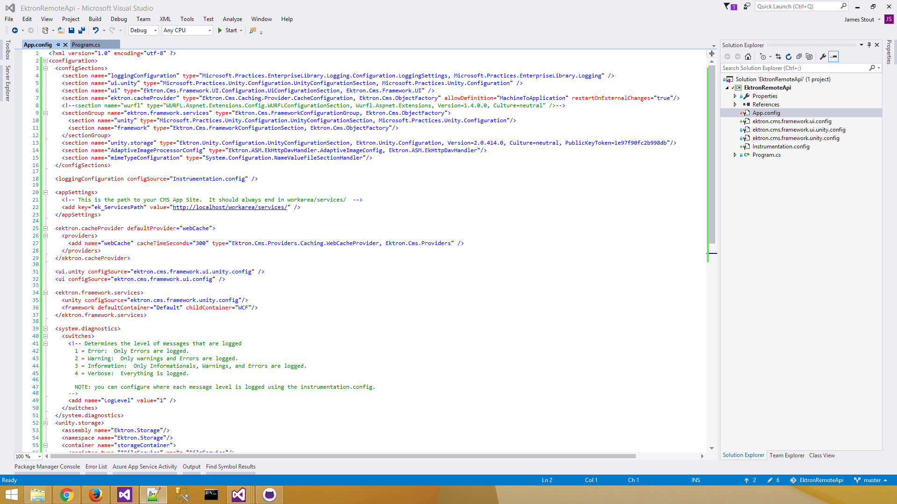
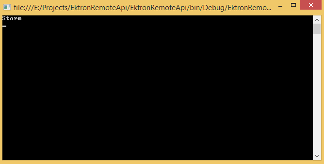
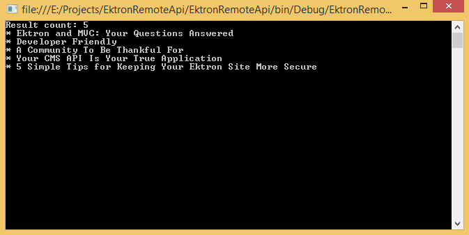

#Ektron 3-Tier WCF and Search

I generally love when a [question or request in the community](http://developer.ektron.com/Forums/?v=t&t=3447) is the inspiration for a blog post, and this is one of those cases. An Ektron developer, Uttam (not sure if that's an actual or screen name), came looking for the *right way* to go about making a search query in Ektron, but from a remote app (3-Tier).

For those who don't know, Ektron actually provides all the tools necessary to do this, including a remote-app .NET SDK. So you don't need to integrate the services directly, just pull over some DLLs and config files (with some adjustments).

##Prepping your Ektron Site

First, you need to make sure that your app is able to access the Ektron WCF endpoints (located at [app root]/workarea/services). When you install Ektron, the default behavior is to add IP restrictions in IIS so that only localhost (127.0.0.1) can access those services. If your app is on the same machine, no worries. Otherwise, you'll have to add your app host IP to the whitelist in IIS.

If you're going to be doing any *writing* or accessing any private content between the app and Ektron, it has to be done with an authenticated user. You can either build authentication into your app or use a dedicated account with the proper authorization and restrictions in place; in other words, only allow the necessary permissions and nothing more - *no admins!*

This article will not cover authenticated WCF requests because they're not necessary to simply perform a search.

###Prerequisites

* Ektron CMS 8.5 or later
* Microsoft Search Server, Microsoft FAST, or SOLR set up, configured, and indexing and returning data successfully
* An IDE, such as Visual Studio

For my test, I'm running Ektron 9.1SP3 (latest at time of writing) and the matching SOLR installation. I'm also running Visual Studio 2015.

##The Approach

You really can use any .NET app to do what I'm about to do. Though the OP is building something in MVC, I chose to spin up a simple Console App in Visual Studio because it requires less effort to get a result and less overhead on my virtual machine to run. The process is the same for either - this is just .NET libraries from Ektron and Unity config.

The real advantage to this approach (Unity) is that it gives you access to (more or less) the exact same Framework APIs that you use in the Ektron application itself. To the point that, for many operations, you can copy the code from one and put it into the other and expect the same outcome.

You can, as the OP was trying to do, integrate directly with the WCF endpoint, but that eliminates all of the constructors and helper methods Ektron provides as part of its API. My way preserves those.

##Adding and Configuring References

Once you've created your app, you'll need to add Ektron's 3-Tier references to your app. Open Solution Explorer and right-click on References and choose Add Reference. You'll want to Browse for the DLLs in the 3TierMin starter site in your **base** Ektron installation - usually `C:\Program Files (x86)\Ektron\(version)\startersites\3TierMin\Content\bin`. Select all and add them.



Next, you'll need Ektron's Unity configurations and some changes to your web/app.config to be able to use the APIs.

Grab each of the `ektron.cms.*` files as well as `Instrumentation.config` out of the same 3TierMin starter site folder and add them to your project. If you add existing or copy/paste them into your app, make sure to check the Properties for each file and set the `Copy to Output Directory` value to either `Copy if Newer` or `Copy Always` so the config files make it into the build directory.



##Configuring Unity for your Search Server

If you're using some flavor of Microsoft Search Server, feel free to skip this step as the Unity configurations in the 3TierMin site are already configured for you.

If you're using Microsoft FAST or SOLR, you'll have to make a quick change to the `ektron.cms.framework.unity.config` file you just copied into your app. Follow the [instructions in our developer documentation](http://documentation.ektron.com/cms400/v9.10/Reference/Web/EktronReferenceWeb.html#3-Tier/3-Tier.htm#Using2) (link is to the more-commonly used SOLR entry; the FAST entry is just below it), which entails a quick copy/paste to overwrite one entire section of the config. However, be careful to overwrite the correct section as there are two in the file with the `<!-- Search-->` label applied. In my case, it was the second one. (Hint: The correct one uses `alias="BusinessObjects.*"` in each of the typeAlias nodes. The wrong one does not.)

##App/Web.config Changes

Finally, you'll need to copy most, but not all, of the content from the 3TierMin web.config into your own app/web.config. I always do this manually. Because I started with a console application, my app.config was pretty bare, so this was no problem. 



I copied the following sections in their entirety:

* `<configSections>` - I did comment out the WURFL node here and avoided copying that section. I had no use for it.
* `<loggingConfiguration>`
* `<appSettings>` - Update the value in this section to use your Ektron application's host name. Leave the path to /workarea/services intact. If you use SSL for your Ektron site, you can update the URL protocol.
* `<ektron.cacheProvider>` - necessary for the Framekwork API Default configuration, which uses a Search Cache with BusinessObjects fallback
* `<ui.unity>`
* `<ui>`
* `<ektron.framework.services>`
* `<system.diagnostics>`
* `<unity.storage>`

If you're building a web app or otherwise retrieving Ektron content via its Alias, you might want to include the `<system.webServer>` section or otherwise steal some of the code from that URL Aliasing Module to use in your app.

##Building and Testing

The obvious first step, once all of the above is complete, is to simply see if your app builds. Unless there's some greater conflict, it should. Using a console app simplifies everything because the app itself without any additional development is just a single Main function (aka a great way to test this stuff).

If it builds, you should be good to go. Search as a first test introduces some complexity simply because it's relying on yet another "moving piece" - the search server itself. While you can might already have made sure it's working within the Ektron application, I still felt a bit funny testing with it right out of the gate. So I did a simple content test first - request content by ID and output the Title. Make sure the content you request is published and publicly available.

```c#
using Ektron.Cms.Framework.Content;
using System;
using System.Collections.Generic;
using System.Linq;
using System.Text;
using System.Threading.Tasks;

namespace EktronRemoteApi
{
    class Program
    {
        static void Main(string[] args)
        {
            var contentApi = new ContentManager();
            var content = contentApi.GetItem(2620);
            if (content != null)
                Console.WriteLine(content.Title);
            else
                Console.WriteLine("Content is null.");
            Console.ReadLine();
        }
    }
}
```



Once this test is complete, I removed the Content code and added a simple Search query.

```c#
using Ektron.Cms.Framework.Search;
using Ektron.Cms.Search;
using Ektron.Cms.Search.Expressions;
using System;
using System.Collections.Generic;
using System.Linq;
using System.Text;
using System.Threading.Tasks;

namespace EktronRemoteApi
{
    class Program
    {
        static void Main(string[] args)
        {
            KeywordSearchCriteria criteria = new KeywordSearchCriteria();

            criteria.QueryText = "MVC";

            criteria.ExpressionTree = SearchContentProperty.Id > 0;

            criteria.ReturnProperties.Add(SearchContentProperty.Id);
            criteria.ReturnProperties.Add(SearchContentProperty.Title);
            criteria.ReturnProperties.Add(SearchContentProperty.HighlightedSummary);

            criteria.PagingInfo = new Ektron.Cms.PagingInfo(5, 1);

            var searchApi = new SearchManager();

            var response = searchApi.Search(criteria);

            if (response?.Results.Count > 0)
            {
                Console.WriteLine("Result count: {0}", response.Results.Count);
                foreach (var item in response.Results)
                {
                    Console.WriteLine("* {0}", item.GetValue(SearchContentProperty.Title));
                }
                Console.ReadLine();
            }
        }
    }
}
```



And that's it!

If you build something awesome using this approach, let me know about it. james.stout@episerver.com